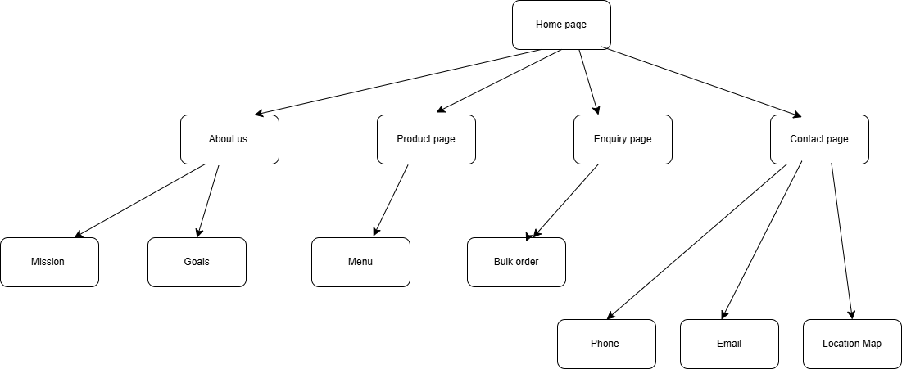

# Project Title
Buddy D'kota Refreshments

## Student Information
**Student number:** ST10510510  
**Student Name:** Reneilwe Damiel Sefolo

## Project Overview

Buddy D’kota refreshments is a small business that sells bottled water for everyday use, events and bulk supply. This business is owned by a young artist named Buddy D’kota the producer of the sound “Mbankho”. The business was established in 2025 while he was in matric. The business mission and vision is to provide fresh and pure quality water at an affordable price. The target audience will be event organizers, local shops, schools and houses.Buddy D’kota refreshments is a small business that sells bottled water for everyday use, events and bulk supply. This business is owned by a young artist named Buddy D’kota the producer of the sound “Mbankho”. The business was established in 2025 while he was in matric. The business mission and vision is to provide fresh and pure quality water at an affordable price. The target audience will be event organizers, local shops, schools and houses

## Website Goals and Objectives

Goals:
•	Increase sales to encourage customers to place more orders, to provide a clear picture of the product and the prices of the products.
•	For customers to be able to contact the business through an enquiry and make it simple for customers to get quotations for large orders.
•	Improve brand awareness, for Buddy D’kota refreshments to build a professional and credible brand image online, create an online presence.
KPIs:
•	Website traffic, the of people who visit the website per month.
•	Conversion rate, the percentage of people who visit the website who become customers, this will show how effective the website is.
•	Repeat customers, the number of customers who come back to place orders again, this shows they are satisfied by the product.

## Timeline and Milestones

•	Week 1: Research and planning 
•	Week 2: Design layout [wireframe]
•	Week 3: Develop HTML pages
•	Week 4: Testing and improvements
•	Week 5: CSS styling
•	Week 6: JavaScript
•	Week 7: GitHub and README

## Sitemap

  

## References

Chaffey, D. and Ellis- Chadwick, F., 2019. Digital Marketing. 7th ed. Harlow: Pearson. 
Figma [2026] Figma: collaborative interface design tool used for low fidelity wireframing. Available at: https://www.figma.com [Accessed: 10 April 2026]  
Krug, S., 2014. Don’t make me think: a common-sense approach to web usability. 3rd ed. Berkeley: New Riders 
Nielsen, J, 2012. Usability 101: Introduction to usability. [online] Nielsen Norman Group available at: https://www.nngroup.com/articles/usability-101-introduction-to-usability [Accessed 31 Mar. 2026]. 
W3schools, 2026. HTML Tutorial. [online] Available at: https://www.w3schools.com/html/ [Accessed 31 Mar. 2026] 

